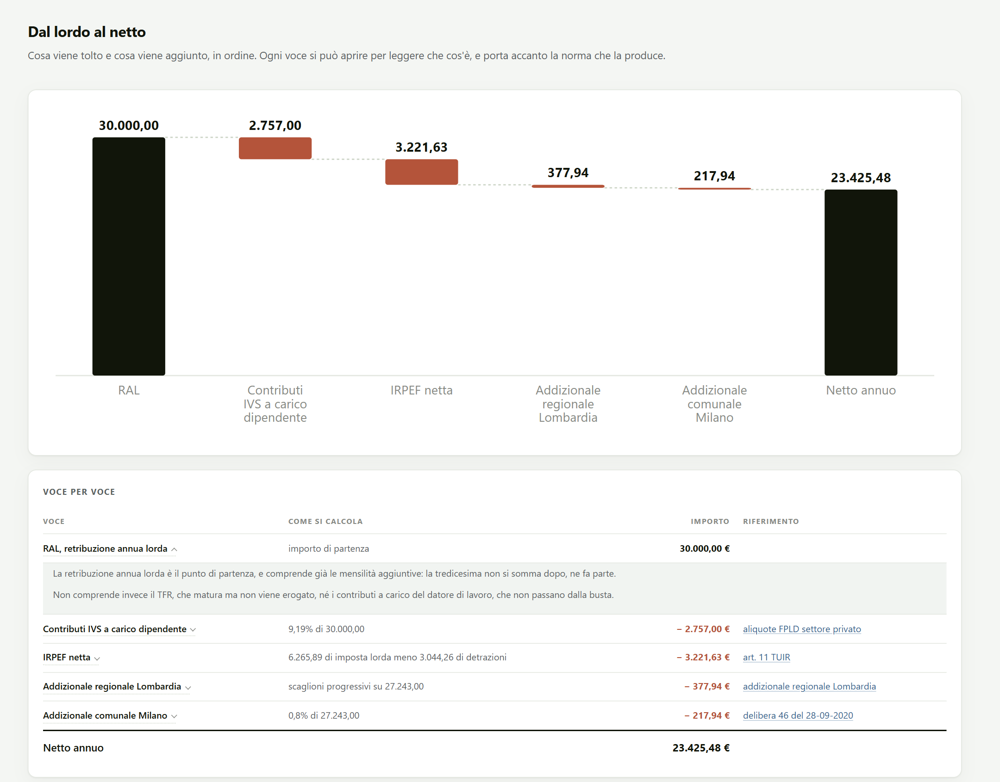
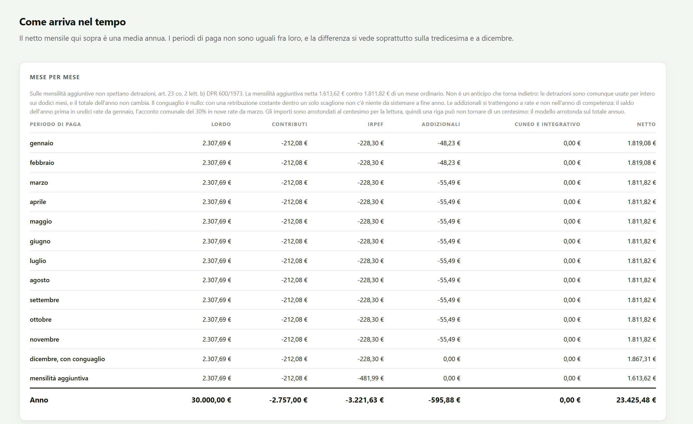
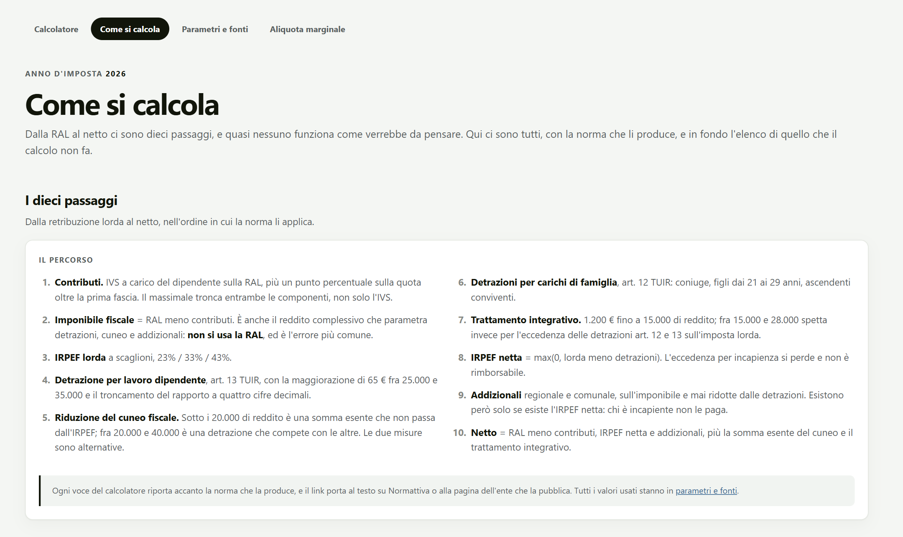
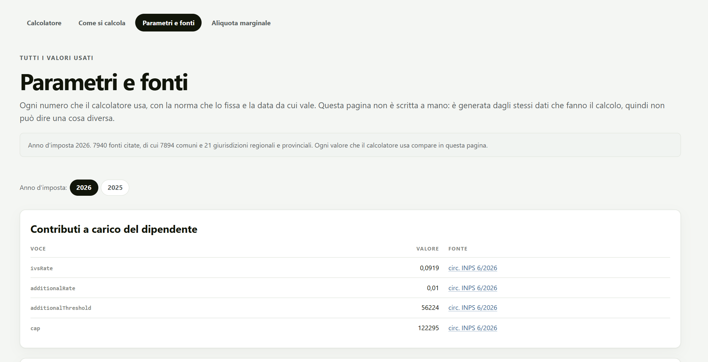
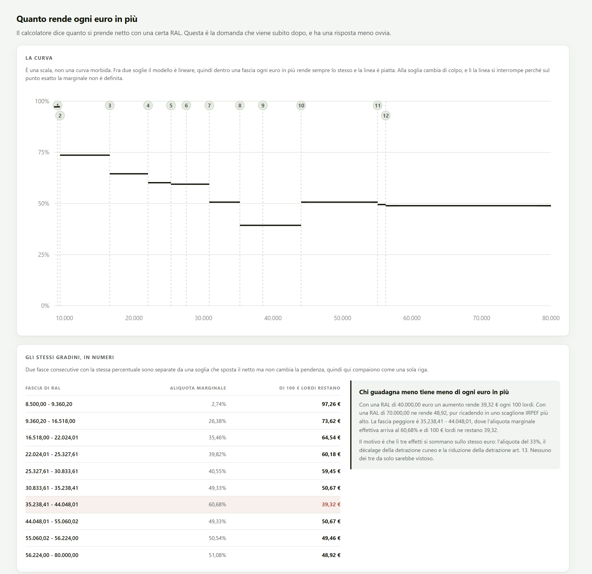

<p align="center">
  
</p>

<h1 align="center">Da RAL a netto</h1>

<p align="center">
  Il calcolo dello stipendio netto di un lavoratore dipendente in Italia,<br>
  voce per voce, con la norma che produce ogni numero.
</p>

<p align="center">
  <a href="https://ghiacciolodev.github.io/ral-netto/"><strong>Apri il calcolatore</strong></a>
  &nbsp;·&nbsp;
  <a href="https://ghiacciolodev.github.io/ral-netto/metodo.html">Come si calcola</a>
  &nbsp;·&nbsp;
  <a href="https://ghiacciolodev.github.io/ral-netto/parametri.html">Parametri e fonti</a>
  &nbsp;·&nbsp;
  <a href="https://ghiacciolodev.github.io/ral-netto/curva.html">Aliquota marginale</a>
</p>

<p align="center">
  Anni d'imposta 2025 e 2026 &nbsp;·&nbsp; 21 regioni e 7.894 comuni &nbsp;·&nbsp; 657 test &nbsp;·&nbsp; nessuna dipendenza
</p>

<br>


## Cosa fa

Si inserisce la retribuzione annua lorda e il sito restituisce il netto annuo e
mensile, insieme a tutto quello che sta in mezzo: contributi, IRPEF, detrazioni,
cuneo fiscale, trattamento integrativo, addizionale regionale e comunale. Ogni voce
porta accanto l'articolo di legge o la delibera che la stabilisce, con il link alla
fonte ufficiale.

Il calcolo tiene conto di residenza, mensilità, rapporti di lavoro inferiori
all'anno, contratto a tempo determinato, familiari a carico e fringe benefit. Funziona
anche al contrario: dato un netto obiettivo, trova la RAL che serve per ottenerlo.

Tutto avviene nel browser. Il sito non salva nulla, non usa cookie, non carica
risorse esterne e non invia da nessuna parte quello che si scrive.

## Le quattro pagine

### Calcolatore

Il netto scomposto in un grafico a cascata e in una tabella voce per voce. Ogni riga
si apre e spiega in parole semplici che cos'è quella trattenuta e perché vale quanto
vale.



Il netto mensile del riepilogo è una media. Il prospetto dei periodi di paga mostra
come arriva davvero mese per mese, secondo l'art. 23 DPR 600/1973: la tredicesima
senza detrazioni, le addizionali trattenute a rate l'anno dopo, il conguaglio di
dicembre.



Nella stessa pagina ci sono il calcolo inverso da netto a RAL e una stima del costo
azienda, tenuta separata e dichiarata come stima perché dipende dal contratto
collettivo e non solo dalla legge.

### Come si calcola

I dieci passaggi dalla RAL al netto nell'ordine in cui la norma li applica, gli
effetti che sorprendono e l'elenco completo di quello che il calcolo non fa.



### Parametri e fonti

Ogni valore usato dal calcolo, anno per anno, con la norma che lo fissa. La pagina
non è scritta a mano: è generata dagli stessi dati che fanno il calcolo, quindi non
può dire una cosa diversa.



### Aliquota marginale

Quanto resta di ogni euro lordo in più. La risposta non è l'aliquota IRPEF del
proprio scaglione: fra 35.000 e 44.000 € di RAL se ne va il 60,68%, più che a 70.000 €,
perché lì la detrazione per lavoro dipendente e quella del cuneo fiscale si riducono
a ogni euro guadagnato. Il grafico mostra tutte le soglie e cosa succede a ciascuna.


 
## Il calcolo

Dieci passaggi, nessuna iterazione.

1. **Contributi.** IVS 9,19% sulla RAL, più 1% sulla quota oltre 56.224 €. Il massimale di 122.295 € tronca entrambe le componenti.
2. **Imponibile fiscale**, cioè RAL meno contributi. È la base di detrazioni, cuneo e addizionali: **non si usa la RAL**.
3. **IRPEF lorda** a scaglioni, 23%, 33% e 43%.
4. **Detrazione per lavoro dipendente**, art. 13 TUIR, con la maggiorazione di 65 € e il troncamento del rapporto a quattro decimali.
5. **Riduzione del cuneo fiscale**: somma esente sotto i 20.000 € di reddito, ulteriore detrazione fra 20.000 e 40.000 €.
6. **Detrazioni per carichi di famiglia**, art. 12 TUIR: coniuge, figli dai 21 ai 29 anni, ascendenti conviventi.
7. **Trattamento integrativo**: 1.200 € fino a 15.000 € di reddito; fra 15.000 e 28.000 € spetta per l'eccedenza delle detrazioni sull'imposta lorda.
8. **IRPEF netta**, lorda meno detrazioni e mai sotto zero. L'eccedenza per incapienza si perde.
9. **Addizionali** regionale e comunale, sull'imponibile e non ridotte dalle detrazioni. Sono dovute solo se è dovuta l'IRPEF netta.
10. **Netto**: RAL meno contributi, IRPEF netta e addizionali, più la somma esente del cuneo e il trattamento integrativo.

### Cose che un conto a mente non vede

| | |
|---|---|
| **La seconda aliquota è al 33%** | Dal 2026, scesa dal 35% con la L. 199/2025. Molte fonti secondarie riportano ancora il vecchio valore. |
| **La no tax area è a 8.500 € esatti** | Perché 1.955 diviso 0,23 fa 8.500. Il numero non compare fra i parametri: emerge dalle regole, e un test lo verifica. |
| **Il netto non sale sempre con il lordo** | Al gradino dell'art. 13, alla soglia di esenzione dell'addizionale comunale e agli scalini della detrazione per il coniuge un euro lordo in più fa scendere il netto. |
| **La tredicesima è tassata di più** | Sulle mensilità aggiuntive le detrazioni non spettano: con RAL 30.000 la tredicesima netta 1.613,62 € contro 1.811,82 € di un mese ordinario. |
| **I fringe benefit sono una soglia, non una franchigia** | Oltre 1.000 € concorre al reddito l'intero valore: con RAL 30.000 un centesimo in più costa 420 € di netto. |
| **Le addizionali seguono l'IRPEF netta** | Chi è incapiente non le paga (art. 50 co. 2 D.Lgs. 446/1997). Con RAL 20.000, coniuge e tre figli a carico il netto arriva a 20.233,78 €, più del lordo. |
| **Dove si abita pesa quanto un aumento** | Con RAL 30.000 fra Trento e Roma ci sono 44 € al mese di differenza: a Roma servono 1.029 € di RAL in più per lo stesso netto. |

## Addizionali locali

Il dataset comprende tutte le **21 regioni e province autonome** e **tutti i 7.894
comuni**, estratti dal portale del federalismo fiscale del MEF. Ogni voce porta il
link alla propria pagina sul portale.

Un ente che non delibera non azzera il tributo: le aliquote in vigore si intendono
prorogate di anno in anno (art. 1 co. 169 L. 296/2006). Per il 2026 hanno deliberato
3.208 comuni, 3.827 applicano aliquote prorogate e 859 non hanno mai deliberato. Il
calcolatore indica sempre da che anno arrivano le aliquote che sta usando.

I comuni sono un estratto di massa: 120 comuni presi a caso sono stati riscaricati
dal portale e confrontati con il dataset, e sono risultati identici tutti e 120. La
procedura di estrazione e rigenerazione è in [tools/README.md](tools/README.md).

## Fonti

Solo fonti primarie: Normattiva per le norme, l'ente emittente per la prassi, il
portale del federalismo fiscale del MEF per le addizionali locali. L'elenco completo,
valore per valore, è nella pagina [Parametri e fonti](https://ghiacciolodev.github.io/ral-netto/parametri.html).

| Parametro | Valore | Fonte |
|---|---|---|
| Scaglioni IRPEF | 23%, 33%, 43% | [art. 11 TUIR](https://www.normattiva.it/uri-res/N2Ls?urn:nir:stato:decreto.del.presidente.della.repubblica:1986-12-22;917), modificato da [L. 199/2025](https://www.normattiva.it/uri-res/N2Ls?urn:nir:stato:legge:2025-12-30;199) |
| Detrazione lavoro dipendente | 1.955 € e formule per fascia | [art. 13 TUIR](https://www.normattiva.it/uri-res/N2Ls?urn:nir:stato:decreto.del.presidente.della.repubblica:1986-12-22;917) |
| Detrazioni per familiari | 800 o 690 € coniuge, 950 € figlio, 750 € ascendente | [art. 12 TUIR](https://www.normattiva.it/uri-res/N2Ls?urn:nir:stato:decreto.del.presidente.della.repubblica:1986-12-22;917) |
| Cuneo fiscale | 7,1%, 5,3%, 4,8% e 1.000 € con décalage | [L. 207/2024 art. 1](https://www.normattiva.it/uri-res/N2Ls?urn:nir:stato:legge:2024-12-30;207) |
| Trattamento integrativo | 1.200 € fino a 15.000 € | [DL 3/2020 art. 1](https://www.normattiva.it/uri-res/N2Ls?urn:nir:stato:decreto.legge:2020-02-05;3) |
| Fringe benefit | 1.000 €, 2.000 € con figli a carico | art. 51 co. 3 TUIR, [L. 207/2024 art. 1 co. 390](https://www.normattiva.it/uri-res/N2Ls?urn:nir:stato:legge:2024-12-30;207) |
| Ritenute mensili e conguaglio | | art. 23 DPR 600/1973 |
| Prima fascia e massimale contributivo | 56.224 € e 122.295 € | [circ. INPS n. 6 del 30 gennaio 2026](https://www.inps.it/it/it/inps-comunica/atti/circolari-messaggi-e-normativa/dettaglio.circolari-e-messaggi.2026.01.circolare-numero-6-del-30-01-2026_15151.html) |
| Addizionale regionale | condizione e rate | [art. 50 D.Lgs. 446/1997](https://www.normattiva.it/uri-res/N2Ls?urn:nir:stato:decreto.legislativo:1997-12-15;446) |
| Addizionale comunale | condizione, acconto e rate | [art. 1 D.Lgs. 360/1998](https://www.normattiva.it/uri-res/N2Ls?urn:nir:stato:decreto.legislativo:1998-09-28;360) |
| Aliquote locali | 21 regioni, 7.894 comuni | [portale del federalismo fiscale MEF](https://www1.finanze.gov.it/finanze2/dipartimentopolitichefiscali/fiscalitalocale/nuova_addcomirpef/risultato.htm?anno=9999&lista=1&r=1&pagina=lombardia.htm&pr=MI&cc=F205) |
| Proroga delle aliquote | | [art. 1 co. 169 L. 296/2006](https://www.normattiva.it/uri-res/N2Ls?urn:nir:stato:legge:2006-12-27;296) |
| TFR | RAL diviso 13,5 | [art. 2120 codice civile](https://www.normattiva.it/uri-res/N2Ls?urn:nir:stato:regio.decreto:1942-03-16;262) |

## Ipotesi e limiti

Un calcolo che non dice cosa ha lasciato fuori non è verificabile, quindi i limiti
sono dichiarati. L'elenco completo è nella pagina
[Come si calcola](https://ghiacciolodev.github.io/ral-netto/metodo.html); questi sono
i principali.

| Non compreso | Perché |
|---|---|
| Oneri deducibili e detraibili | Sull'aliquota dell'art. 15 TUIR, 22% nel testo consolidato e 19% nella prassi, la fonte non è ancora chiusa. |
| Welfare aziendale e premi di risultato | Hanno una tassazione propria. |
| Regimi agevolati, impatriati, forfettario | Hanno una base imponibile propria. |
| Esenzioni comunali per tipo di reddito | 127 comuni esentano pensioni o redditi specifici invece di fissare una soglia: sono segnalati nell'interfaccia. |
| Agevolazioni soggettive regionali | Si applicano le aliquote ordinarie per scaglione. |
| Redditi oltre 200.000 € | La sterilizzazione del beneficio non è implementata e il calcolo non è valido. |
| Costo azienda | È una stima su medie di categoria, non un calcolo di legge. |

Il prospetto mensile applica l'art. 23 alla lettera; molti software paghe usano il
metodo del reddito presunto annuo, che distribuisce diversamente lo stesso totale.

## Come è costruito

**Il motore restituisce il percorso, non solo il numero.** Ogni calcolo produce
l'elenco ordinato delle voci dal lordo al netto, ciascuna con formula e norma. Grafico,
tabella e citazioni sono tre modi di leggere lo stesso elenco, e un test verifica che
la somma delle voci ricostruisca il netto al centesimo.

**Ogni provvedimento è una regola** con tre facce tenute insieme: cosa calcola, cosa
scrive nella traccia, quali soglie introduce. Aggiungerne una senza le altre non è
possibile.

**Il modello senza troncamenti è affine a tratti.** Questa struttura guida il
grafico dell'aliquota marginale, il calcolo inverso e la scelta dei casi di test
sulle soglie. In [src/engine/inverse.js](src/engine/inverse.js), il risolutore ricava
un candidato in forma chiusa per ogni segmento non costante, usando due punti
interni del modello con `exactRatios: true`. Poi `refineCandidate` lo rifinisce
localmente contro il modello completo, con una scansione a passi di 0,001 € entro
0,50 € dal candidato, limitata al segmento. I troncamenti dei rapporti delle
detrazioni producono infatti una scalinata che il modello affine non rappresenta.
Il calcolo inverso combina quindi candidati analitici e rifinitura numerica locale:
non è interamente in forma chiusa. Gli arrotondamenti monetari riguardano la
formattazione degli importi; il risolutore confronta il netto non arrotondato.

**Un anno d'imposta è un file.** Parametri e fonti di ogni anno stanno in un file
completo, verificabile da solo; un test controlla che 2025 e 2026 differiscano solo
nei punti previsti. Il motore non contiene numeri.

**Zero dipendenze, nessuna build.** Il repository è il sito. Gli script sono caricati
in ordine senza moduli, così le pagine funzionano anche aperte con un doppio clic.

## Test

```bash
node test/run.js
```

657 asserzioni in 14 suite, eseguibili anche nel browser aprendo `test/runner.html`. I
valori attesi sono calcolati dalle formule di legge, mai copiati dall'output del codice.

## Aggiornare all'anno successivo

Si copiano `src/parameters-2026.js` e `src/local-2026.js` nei file del nuovo anno, si
aggiornano valori e fonti, si registrano in `src/parameters.js` e si caricano nelle
pagine. Il dataset comunale si rigenera con i due comandi descritti in
[tools/README.md](tools/README.md).

## Struttura

```
index.html                 calcolatore
metodo.html                come si calcola
parametri.html             parametri e fonti, generata dai dati
curva.html                 aliquota marginale
favicon.svg
src/parameters.js          registro degli anni d'imposta
src/parameters-2025.js     parametri statali e fonti 2025
src/parameters-2026.js     parametri statali e fonti 2026
src/local-2025.js          addizionali di regioni e comuni 2025, generato
src/local-2026.js          addizionali di regioni e comuni 2026, generato
src/engine.js              assemblaggio del motore
src/engine/                numeri, posizione, regole, calcolo, soglie, inverso, prospetto mensile
src/explanations.js        spiegazioni delle voci
src/ui-*.js                una interfaccia per pagina
src/styles.css
test/                      runner, fixture e 14 suite
tools/                     estrazione dal portale MEF e generazione del dataset locale
docs/screenshots/          immagini di questo README
```

<br>

<p align="center">
  <sub>I risultati sono stime basate sulla normativa in vigore e sulle ipotesi dichiarate.<br>Non sostituiscono il cedolino né il parere di un consulente del lavoro.</sub>
</p>
